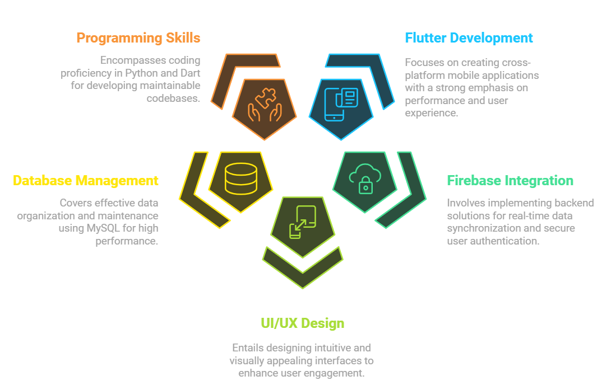

  

  
  <!--for green animation:  
  alternate color: color=09F7F7 -->

  

# <picture></picture> <b> About me </b>
- 🎓 **Computer Science & Engineering Graduate** from <a href="https://www.bracu.ac.bd/">BRAC University</a> | BSc in Computer Science & Engineering 
- 💼 Aspiring **Flutter Developer** with expertise in mobile (iOS & Android) and cross-platform apps
- 🌍 Open to **Remote Opportunities** worldwide
- 📖 Passionate about **continuous learning**, **problem-solving**, and **technology-driven solutions**

  

  

# <b> Tech Stack </b>

<table align="center">
  <tr>
    <td align="center" width="140">
       <b>Flutter</b>
    </td>
    <td align="center" width="140">
       <b>Firebase</b>
    </td>
    <td align="center" width="140">
       <b>Dart</b>
    </td>
    <td align="center" width="140">
       <b>Figma</b>
    </td>
    <td align="center" width="140">
       <b>MySQL</b>
    </td>
    <td align="center" width="140">
       <b>Python</b>
    </td>
  </tr>
</table>

  

  

 <!--
#   Online Learning & Odyssey

  
  
  
  
  
  
  

  

  
-->

#  **My Expertise**

  

 

  

#   Aesthetic Coding Setup

        
   
   

  

  

# <b> Github Stats </b>

  
  
  

  

  

#  Milestones & Top Projects

 <table> <tr> <td align="center">   <strong>2024</strong> Final Year Project (Completed)  <em> <a href="https://github.com/Rayean-Mahmud/SafeConnect-A-Personal-Safety-Emergency-Alert-and-Connectivity-App-Flutter-Dart-Firebase">SafeConnect</a>- Real-Time Emergency Alert App</em> </td> <td align="center">   <strong>2023</strong> Completed  <em>HealthLink - Doctor Appointment System</em> </tr> </table> 

  

  

#  Fun Facts
- My IDE runs on as much caffeine as it does on code. Some people count hours; I count cups of coffee. 
- Off-duty? I’m exploring new tech, dreaming of building the “next big thing,” or convincing my friends that coding is fun! 😊

  

  

# <b> Resume </b>

  

  

  

# <b> Connect with Me </b>

  
  
  
   

  

 

  

  

